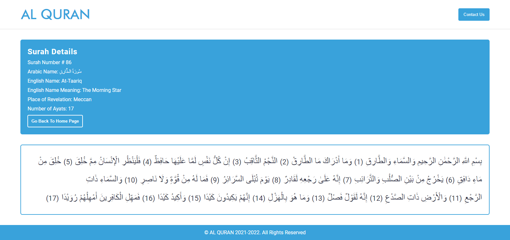

<!-- PROJECT LOGO -->
<br />
<p align="center">
  <a href="https://github.com/sheharyarIshfaq/Al-Quran">
    
  </a>

  <h3 align="center">AL QURAN</h3>

  <p align="center">
    A Quran Web App build with React js and API from Quran Cloud. User can read the surahs of Holy Quran by using this website
    <br />
  </p>
</p>

<!-- TABLE OF CONTENTS -->
<details open="open">
  <summary>Table of Contents</summary>
  <ol>
    <li>
      <a href="#about-the-project">About The Project</a>
      <ul>
        <li><a href="#built-with">Built With</a></li>
      </ul>
    </li>
    <li>
      <a href="#getting-started">Getting Started</a>
      <ul>
        <li><a href="#installation">Installation</a></li>
      </ul>
    </li>
    <li><a href="#contact">Contact</a></li>
  </ol>
</details>

<!-- ABOUT THE PROJECT -->

## About The Project




Al Quran is a Web Application built with React js, React Router and an API from Quran Cloud. It Fetches all the surahs of Holy Quran from the Api and displays them as a list with surah number, english name, english name translation and arabic name. When a particular surah is clicked, the user is redirected to a page using React Router where some information about that surah is displayed along with the ayats of that surah. The user can read the surah.

The UI/UX of this web app is smooth and simple. There is proper space and content is easily visible on all types of devices/screens. It is completely responsive and you can check it out by visiting the link below.

Live Preview Link: https://al-quran-a519d.web.app/

### Built With

This projects was built using React js, react router, custom css.

- [React](https://reactjs.org/)
- [React Router](https://reactrouter.com/)

<!-- GETTING STARTED -->

## Getting Started

This is an example of how you may give instructions on setting up your project locally.
To get a local copy up and running follow these simple example steps.

### Installation

1. Clone the repo
   ```sh
   git clone https://github.com/sheharyarIshfaq/Al-Quran.git
   ```
1. Install NPM packages
   ```sh
   npm install
   ```
1. Run the project on local host
   ```sh
   npm start
   ```

<!-- CONTACT -->

## Contact

Sheharyar Ishfaq - [Facebook](https://web.facebook.com/sheharyarishfaq1) - [Linkedin](https://www.linkedin.com/in/sheharyar-ishfaq/)

Project Link: [AL Quran Repository](https://github.com/sheharyarIshfaq/Al-Quran)

Live Preview Link: [Al Quran](https://al-quran-a519d.web.app/)
